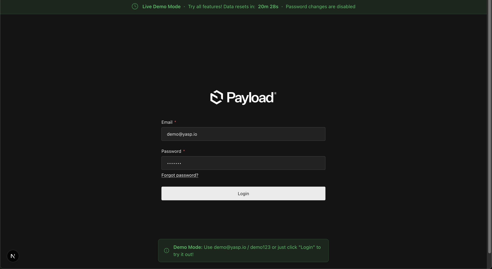
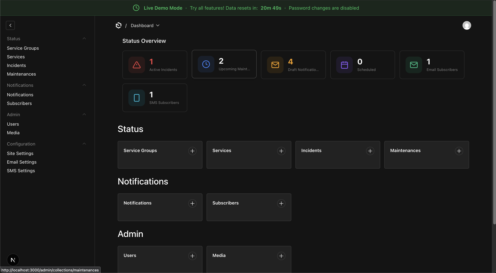
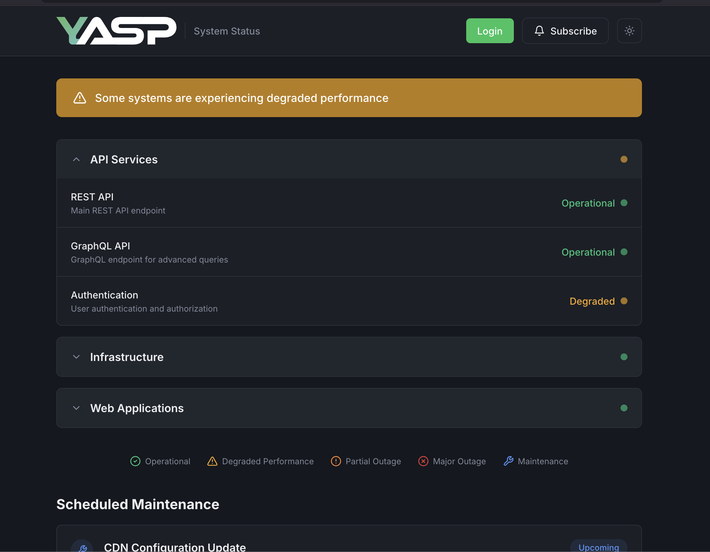

# Yet Another Status Page

A modern, self-hosted status page built with [Payload CMS](https://payloadcms.com/) and [Next.js](https://nextjs.org/).

[](https://github.com/Hostzero-GmbH/yet-another-status-page/actions/workflows/docker-publish.yml)
[](https://hostzero-gmbh.github.io/yet-another-status-page)
[](LICENSE)

[](https://vercel.com/new/clone?repository-url=https%3A%2F%2Fgithub.com%2FHostzero-GmbH%2Fyet-another-status-page&env=PAYLOAD_SECRET&envDescription=Required%20environment%20variables%20for%20Yet%20Another%20Status%20Page&envLink=https%3A%2F%2Fhostzero-gmbh.github.io%2Fyet-another-status-page%2Fgetting-started%2Fconfiguration.html&project-name=yet-another-status-page&repository-name=yet-another-status-page&stores=%5B%7B%22type%22%3A%22postgres%22%7D%2C%7B%22type%22%3A%22blob%22%7D%5D)

> **Note**: After deploying to Vercel, make sure to add a **Vercel Blob** store in your project's Storage settings for media uploads to work.

## 🎯 Live Demo

Try out the admin interface without installation! The demo environment automatically resets every hour.

**Demo Login**: [https://demo.yasp.io/admin/login](https://demo.yasp.io/admin/login)

```
Email: demo@yasp.io
Password: demo2026#
```

### Screenshots

**Demo Login Page with Auto-filled Credentials**



**Admin Interface with Demo Banner**



**Checkout the demo using Login button**



## Features

- **Incident Management** — Track and communicate service disruptions with timeline updates
- **Scheduled Maintenance** — Plan and notify users about upcoming maintenance windows
- **Email & SMS Notifications** — Automatic subscriber notifications via SMTP and Twilio
- **Service Groups** — Organize services into logical groups
- **Beautiful UI** — Modern, responsive status page with dark mode support
- **Self-Hosted** — Full control over your data and infrastructure
- **Docker Ready** — Easy deployment with Docker and Docker Compose
- **Live Demo Mode** — Optional, opt-in demo environment with automatic resets (see [Demo Mode docs](docs/src/getting-started/demo-mode.md))

## Quick Start

```bash
# Clone the repository
git clone https://github.com/Hostzero-GmbH/yet-another-status-page.git
cd yet-another-status-page

# Start the services
docker compose up -d
```

Visit:

- **Status Page**: http://localhost:3000
- **Admin Panel**: http://localhost:3000/admin

## Run Your Own Demo

YASP ships an optional **Live Demo Mode** that boots a fully-functional admin
with pre-seeded data and periodic auto-resets - useful for evaluation,
sandboxes, or public showcase pages.

> **Warning:** Demo mode is **destructive**. It deletes and reseeds all
> application data at the configured interval. Only enable it on a dedicated
> or disposable database - never on production data.

```bash
docker compose -f docker-compose.demo.yml up -d
```

This sets `DEMO_MODE=true` on the app container, which:

- Seeds the database with realistic sample data on startup
- Schedules automatic resets every `DEMO_RESET_INTERVAL_MINUTES` (default 60)
- Shows a demo banner with countdown in the admin panel
- Auto-fills the login form with the demo credentials
- Adds a "Login" button to the public status page
- Blocks password changes on the demo user account

See [the Demo Mode docs](docs/src/getting-started/demo-mode.md) for full
configuration, security considerations, and Kubernetes/Helm deployment notes.

## Documentation

📚 **[Full Documentation](https://hostzero-gmbh.github.io/yet-another-status-page)**

- [Installation Guide](https://hostzero-gmbh.github.io/yet-another-status-page/getting-started/installation/)
- [Configuration](https://hostzero-gmbh.github.io/yet-another-status-page/getting-started/configuration/)
- [Demo Mode](docs/src/getting-started/demo-mode.md)
- [Admin Guide](https://hostzero-gmbh.github.io/yet-another-status-page/admin/overview/)
- [API Reference](https://hostzero-gmbh.github.io/yet-another-status-page/api/rest/)
- [Local Development](https://hostzero-gmbh.github.io/yet-another-status-page/development/local-setup/)

## Tech Stack

| Component | Technology                                     |
| --------- | ---------------------------------------------- |
| Framework | [Next.js 15](https://nextjs.org/) (App Router) |
| CMS       | [Payload CMS 3.x](https://payloadcms.com/)     |
| Database  | PostgreSQL                                     |
| Styling   | Tailwind CSS                                   |
| Email     | Nodemailer (SMTP)                              |
| SMS       | Twilio                                         |

## Contributing

Contributions are welcome! Please read our [Contributing Guide](CONTRIBUTING.md) for details on development setup, coding standards, and the pull request process.

## Security

For security concerns, please review our [Security Policy](SECURITY.md). Do not report security vulnerabilities through public GitHub issues.

## License

This project is licensed under the MIT License - see the [LICENSE](LICENSE) file for details.
